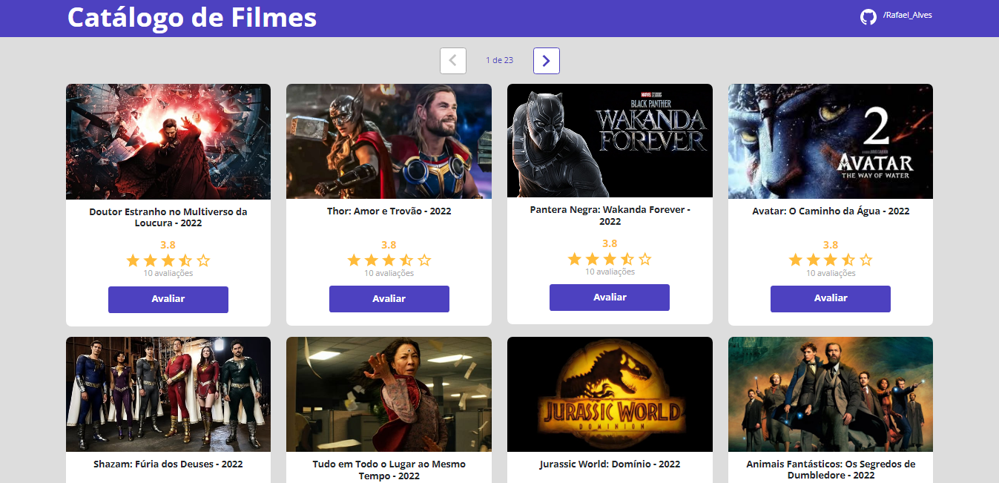

<h1 align="center">Catálogo de Filmes</h1>

Projeto construido na Semana Spring React para praticar as ferramentas básicas de desenvolvimento web.

---

<h1 align="center">
  
</h1>

---
 
### 🛠 Tecnologias:

As seguintes ferramentas foram usadas na construção do projeto:

---

<h2>👩🏽‍💻 Autor:</h2>
 

<h3>Rafael Alves</h3>

Projeto realizado por Rafael Alves Teixeira

Com orientação do professor Nélio Alves da escola DevSuperior

